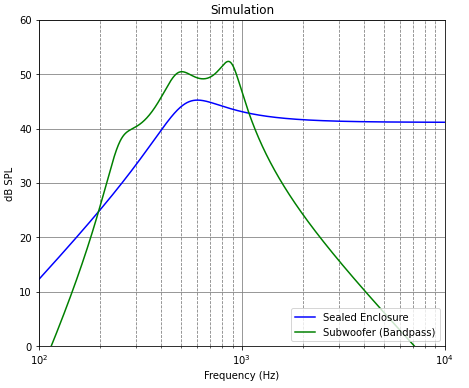

# Electro-Acoustics: Lumped Parameters - Equivalent circuits. 
## Speakers in enclosures. Simulations with validations

Stephane Dedieu, March-April 2023

These programs were developped for clients in a consulting practice, back in 2006-2009.   
Initially all codes were Matlab or open source Scilab scripts.  
We coded them "as is" in Python.  

### <ul> Extraction of Thiele-Small parameters </ul>

<ul> Miniature speaker NXP Grace.   We measure Thiele-Small parameters and compare with manufacturer's data. </ul>

<ul> "Thiele-Small parameters" refers to a set of electromechanical parameters defining how a speaker driver performs:
in the Thiele-Small model, the speaker is assumed to be a one degree of freedom damped system: a mass, a spring and a damper.  
The equivalent circuit is a RLC. In the impedance models: an inductance (L ~speaker cone/diaphragm mass), a capacitor C (1/C ~ speaker suspension stiffness) and a resistor (R ~damping).  
TS Parameters are determined through the analysis of the speaker impedance around its first resonance $f_0$. </ul>

### <ul> Ported enclosures with NXP 11x15mm miniature speaker </ul>

<ul> Miniature speaker in a 7-cc ported enclosure and acoustic bandpass filter.  </ul>  

<ul>
 
| 
<b> Model </b>
            | 
<b> Simulation </b>
  | 
| :--- | :--- | 
| 
  
 | 
  
 |
|  
 Bass reflex enclosure 
  |     
 Frequency response  
            |
| 
  
  |   
  
    |
|  
 Subwoofer - 6th Order Box 
 |  
 Frequency response  
       |

</ul>

### <ul> Passive Radiator - Validation with WinISD </ul>

<ul> Tymphany Peerless 2" speaker and 4" passive radiator in a 500cc enclosure.   </ul>

<ul>
 
| Model           | Frequency response | 
| --- | --- | 
|                       |                    |
| Bass reflex enclosure |                     |
|            |     |
| "Subwoofer" |         |

</ul>

